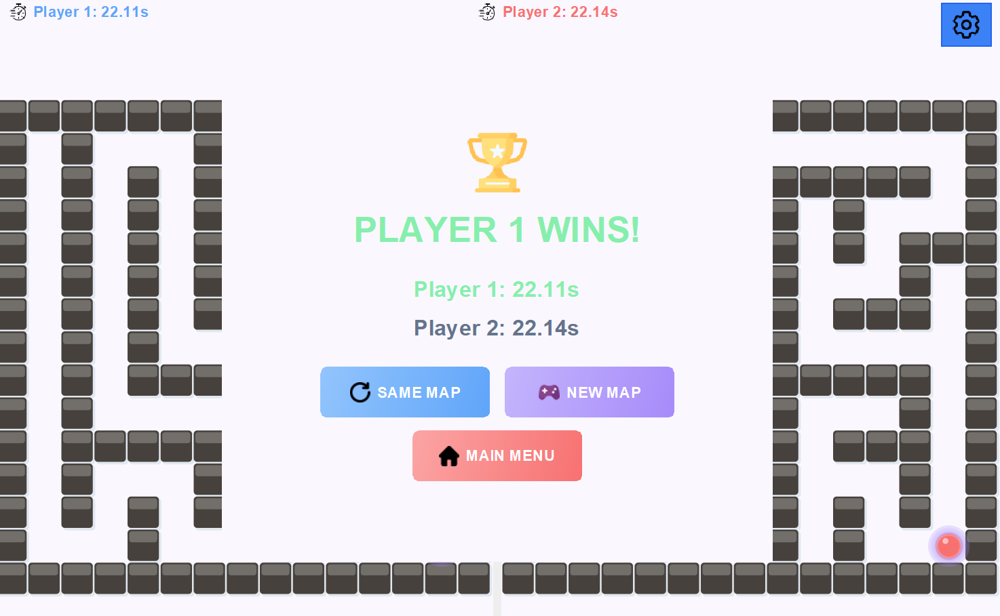
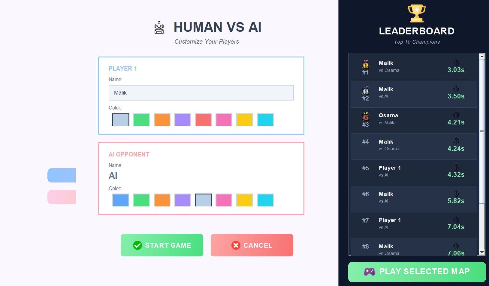

# 🌀 Maze Race Game

**Maze Race** is a competitive labyrinth-solving game built in Java. It features a robust **Human vs. AI** mode driven by a Depth-First Search (DFS) algorithm, as well as a local **2-Player** mode. The project demonstrates advanced object-oriented design, custom Swing UI rendering, and procedural map generation.

## 🚀 Key Features

* **🤖 Intelligent AI Opponent:** Implements a **Depth-First Search (DFS)** algorithm with backtracking to solve mazes dynamically in real-time.
* **🗺️ Procedural Generation:** Utilizes **Recursive Backtracking** to generate unique, perfect mazes (no loops, single solution) for every match.
* **👥 Game Modes:**
    * **Human vs. AI:** Race against the computer.
    * **Human vs. Human:** Local multiplayer (WASD vs. Arrow Keys).
* **💾 Persistence System:** Custom serialization to save high scores, player names, and **map snapshots**, allowing users to replay specific maze configurations.
* **🎨 Modern UI/UX:** Custom-painted Swing components with anti-aliasing, gradient buttons, responsive layouts, and a pastel color palette.
* **⚡ Multithreading:** Separate threads for AI logic and Game Loop timers to ensure a responsive UI without freezing.

## 🛠️ Technical Stack

* **Language:** Java (JDK 8+)
* **GUI Framework:** Java Swing / AWT
* **Concepts:** OOP, Algorithms (DFS, Backtracking), Multithreading, Serialization, Event Handling.

## 📂 Project Structure

* `AIPlayer.java`: Logic for the AI agent using Stack-based backtracking.
* `MazeGenerator.java`: Generates random mazes.
* `GameState.java`: Thread-safe state management for player positions and timings.
* `Leaderboard.java`: Handles I/O operations for saving/loading scores and map data.
* `MazePanel.java`: Custom `JPanel` responsible for 3D-style rendering of walls and players.

## 🎮 How to Download & Run

1.  **Open your Command Prompt** (cmd).

2.  **Copy and paste this entire line** (this moves to your Downloads folder and downloads the game in one step):
    ```bash
    cd Downloads && git clone https://github.com/MalikFikret/MazeRaceGameProject.git
    ```
2.  Open the project in your preferred IDE (IntelliJ IDEA, Eclipse, or NetBeans).
3.  Run the `Main.java` file located in the `modulProject` package.

## 📸 Screenshots

| Main Menu |
|:---:|
|  |

| Gameplay |
|:---:|
|  |

| AI Mode / Leaderboard |
|:---:|
|  |

<br>

---

### 💻 Developed By

This project was created by a team of Computer Engineering students:

* **Malik Fikret**
* **Elifnur ŞİMŞEK**
* **Asya Mine ATİK**

---
